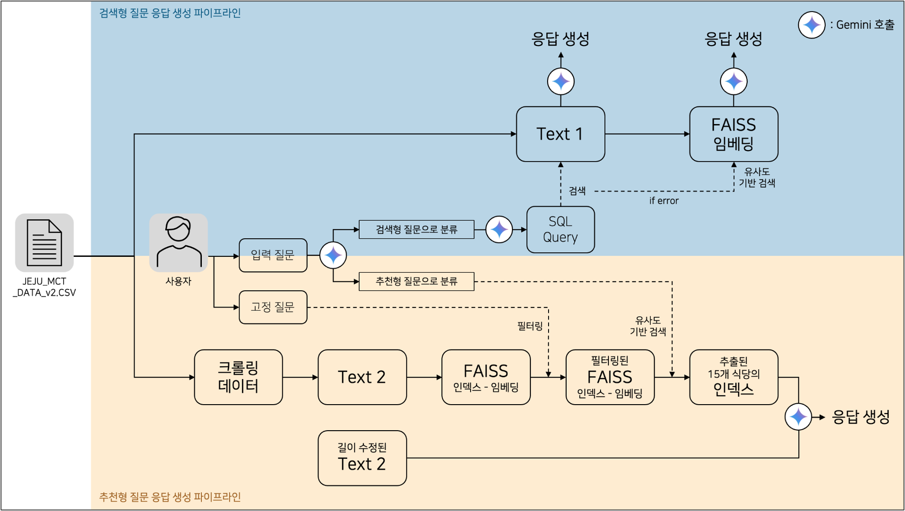
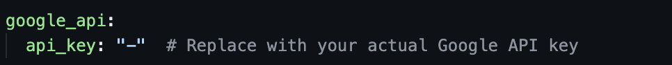

# KAIT 주최 및 신한카드 주관 - 2024 빅콘테스트 생성형AI분야 

  
본 리포지토리는 **LLM활용 제주도 맛집 추천 대화형 AI서비스 개발**에 대한 이쁘면 DA 팀의 제출 서비스 동작을 위한 코드를 포함하고 있습니다.

<br><br> 

<p align="center">

</p>

<br><br>
## Table of Contents
1. [선택 분석 주제 소개](#1-소개)
2. [데이터셋 소개](#2-데이터셋-소개)
3. [데이터 전처리](#3-데이터-전처리)
4. [서비스 개요](#4-서비스-개요)
5. [분석 방향성](#5-분석-방향성)
6. [레포지토리 구조(Repository Structure)](#6-레포지토리-구조-repository-structure)
7. [실행 방법](#7-실행-방법-how-to-run)

## 1. 소개
 
> 분석 주제명: 감정과 상황을 반영한 개인화된 제주 맛집 추천 서비스
<br><br>

### 문제 정의
**문제점**: 기존 맛집 추천 서비스는 평점, 위치, 카테고리에 집중합니다.
- 현대 소비자는 단순한 정보 제공을 넘어, 개인의 취향, 감정, 상황을 반영한 맞춤형 서비스를 기대합니다.
- 특히 음식 선택은 감정과 밀접한 연관이 있으며, 여행지에서의 외식 경험은 그날의 기분, 동행자, 일정에 따라 달라집니다.
- 감정과 상황을 반영한 맞춤형 맛집 추천 서비스는 아직 부족한 상태입니다.


### 목적
1. `정보 검색형 추천`: 신한카드 데이터를 기반으로 정보 검색형 추천을 제공하는 동시에, 사용자의 감정과 상황을 분석하여 맞춤형 맛집 추천을 통해 더욱 만족스러운 외식 경험을 제공하는 것을 목표로 합니다.
2. `사용자 맞춤형 추천`: 숨겨진 현지 맛집부터 인기 있는 장소까지 다양한 선택지를 제공하여 복잡한 검색 없이도 사용자가 원하는 분위기와 시간에 맞는 식당을 쉽게 찾을 수 있도록 돕습니다.


<br><br>

## 2. 데이터셋 소개
서비스 동작에 필요한 최종 데이터셋 소개

1. 신한카드 제주 가맹점 이용 데이터
- 기간 : 2023년 1월 ~ 2023년 12월
- 대상가맹점 : 제주지역 가맹점 중 요식관련 업종이면서 월별 업종별 매출 상위 30% 가맹점	
<p align="center">

</p>

2. 카카오맵 크롤링 데이터
- 신한카드 데이터에 있는 가맹점 이름을 바탕으로 카카오맵에서 해당 식당의 상세보기 링크를 추출
- 식당 정보 및 리뷰 데이터를 수집

<p align="center">

</p>

## 3. 데이터 전처리
신한카드 데이터셋과 카카오맵 크롤링 데이터셋에 대한 데이터 수집 및 전처리 코드는 [`./preprocessing`](./preprocessing) 디렉토리에 저장되어 있습니다.

>신한카드 데이터 전처리
> 1. 컬럼명 한글로 변경
> 2. 월별 통계 데이터에서 `'가맹점명'`과 `'주소'`가 동일한 식당 중복 데이터 처리 후, 고유한 식당 데이터만 남김
> 3. 신한카드 데이터를 기반으로 각 식당의 기본 정보를 요약하여 하나의 문장으로 요약한 `Text 1`칼럼 생성 
> 4. `Address_map` 칼럼에 메인페이지 지도 상에 표시된 13개 구역에 포함되도록 `주소` 수정
> 5. `목적` 칼럼에 `업종`에 따라 ‘식사' 나 ‘카페/디저트'로 분류

> 카카오맵 크롤링 데이터 전처리
> 1. Review_date`에 '정보 없음'과 2020년 이전 데이터는 제거
> 2. 카카오맵의 상세보기 링크 추출을 첫번째 링크 기준으로 가져왔기 때문에, 크롤링하려는 식당과 다른 식당들 제거.
>  - 링크가 없을 경우도 제거
> 3. `Address_map`에 메인페이지 지도 상에 표시된 13개 구역에 포함되지 않는 식당은 제거.
> 4. `Category`에서 ‘식사' 나 ‘카페/디저트'에 해당되지 않으면 (‘기타’ 카테고리) 제거
> 5. 식당 기본 정보 요약과 리뷰 데이터 기반 15가지 카테고리 키워드를 담은 `Text 2` 칼럼 생성


## 4. 서비스 개요
### 메인 페이지:
<p align="center">

</p>

### 메인 페이지- 선택적인 고정 질문:

<p align="center">

</p>
<p align="center">

</p>

고정 질문:
- 방문 예정 날짜: 캘린더에서 직접 선택
- 시간대: 아침, 점심, 오후, 저녁, 밤 중 선택
- 인원수: 혼자, 2인, 3인, 4인 이상 중 선택
- 방문 목적: 식사, 카페/디저트, 선택 안 함
- 방문 지역: 사용자가 방문하고자 하는 제주도 지역 선택

### 챗봇 대화 페이지:
</p>
<p align="center">

</p>

## 5. 분석 방향성

</p>
<p align="center">

<br>
<em>윗부분에서 검색형 질문에 대한 응답 생성 파이프라인을, 아래 부분에서 추천형 질문에 대한 응답 생성 파이프라인을 보여줍니다.</em>
</br>
</p>

**1.검색형 질문**
- 목적: 신한카드 데이터(JEJU_MCT_DATA_v2.CSV)를 바탕으로 정보 검색형 질문에 답합니다.
- 데이터: 제공된 신한카드 데이터
- Text 1 생성: 데이터 칼럼을 요약하여 모든 값을 정확하게 반영한 Text 1을 생성하고 이를 바탕으로 Gemini 1.5 Flash가 추천을 진행합니다.

**2.추천형 질문**
- 목적: 사용자의 감정과 상황을 바탕으로 맞춤형 제주도 맛집을 추천합니다.
- 데이터: 신한카드 데이터에서 등록된 식당 이름을 바탕으로 카카오맵 크롤링을 통해 리뷰와 기본 정보를 수집합니다.
- 키워드 추출: 리뷰 데이터를 기반으로 15가지 주요 카테고리별 키워드를 GPT 4.0 mini API로 추출합니다


## 6. 레포지토리 구조 (Repository Structure)

```
# 서비스 구현에 필요한 데이터들을 보관하는 디렉토리
└──data
│   ├── categorized_restaurants.csv # 식사, 카페/디저트 분류를 위한 파일
│   ├── crawled_kakao_restaurant_with_address_map_text2.csv # 최종 카카오맵 크롤링 데이터
│   └── shinhancard_data_with_text.csv # 최종 신한카드 데이터
│ 
├──modules
│   ├── modified_updated_text1_restaurant_embeddings.npy # 최종 신한카드 데이터 임베딩 파일
│   ├── modified_updated_text1_restaurant_faiss.index # 최종 신한카드 데이터 FAISS 인덱스
│   ├── updated_text2_kakao_restaurant_embeddings.npy # 최종 카카오맵 데이터 임베딩 파일
│   ├── updated_text2_kakao_restaurant_faiss.index # 최종 카카오맵 데이터 FAISS 인덱스
│   └── ...
│ 
├── preprocessing
│   ├── text1_addressmap_purpose.py # 신한카드 데이터에서 방문목적 칼럼과 스트림릿 기준으로 "address_map" 칼럼 생성
│   ├── text1_faiss.py # FAISS 인덱스 빌드
│   ├── text1_shinhancard_preprocessing.py #중 복 제거, 컬럼명 한글로 변경, 각 행에 대한 텍스트 설명하는 text1 칼럼 생성
│   ├── text2_gpt4.0mini.py # 카카오맵 크롤링 데이터에서 리뷰 데이터로 식당 정보 요약 함수
│   ├── text2_added_kakao_crawling_name_address1,2.py # 카카오맵상의 주소 크롤링
│   ├── text2_categorized_restaurants.csv_generate.py # 카카오맵 크롤링 데이터에서 "식사", "카페/디저트", "기타"로 분류
│   ├── text2_faiss.py # text2에서 FAISS 인덱스 빌드 
│   ├── text2_jejumap_address_preprocessing.py # 카카오맵 크롤링 데이터에서 주소 고정질문 필터링을 위한 전처리
│   ├── text2_kakao_crawling_detailedlinks.py # 카카오맵에서 식당 이름으로 검색 후 상세보기 링크 수집
│   ├── text2_kakao_crawling_infosummary.py # 카카오맵 상세보기 링크에서 정보(식당 시설 정보, 메뉴 정보, 등등)와 리뷰 데이터 수집
│   ├── text2_remove_gita_restaurants.py # 방문 목적에서 '기타'에 해당하는 카테고리의 식당들을 제거하고 '기타'에 해당하는 카테고리 리스트와 해당 식당들을 출력
│   └── text2_shorter_summary.py # 카카오맵 크롤링 데이터에서 text2 식당 정보 요약 함수
│ 
├── utils
│   ├── config.py # Contains configuration settings for the project, such as file paths or API keys
│   ├── faiss_utils.py # text1의 FAISS index랑 Embed text불러오는 함수
│   ├── filter_fixed_inputs.py # 신한카드랑 카카오맵 데이터에서 선택된 방문 목적과 방문 지역에 따라 필터링, 카카오맵에서 방문 요일, 시간, 인원수에 따라 faiss검색 시 다른 키워드가 추가하는 함수
│   ├── sql_utils.py # 신한카드 데이터에서 sql 쿼리 생성과 실행하는 함수
│   ├── text1_response_generator.py # 실행된 sql 쿼리 결과로 답변을 생성하는 함수, sql쿼리가 실행 안됐을 경우 faiss로 유사한 식당 추천하는 함수
│   ├── text2_response_generator.py # 사용자 입력과 유사한 상위 15개의 레스토랑 반환하는 함수
│   └── user_input_detector.py # 사용자가 입력한 질문이 검색형 질문인지, 추천형 질문인지 감지하는 함수
│ 
├── geojson & images # streamlit 소스 디렉토리
│ 
├── config.yaml # 사용자 configuration setting 파일
│ 
├── main.py # 애플리케이션 시작 지점
│ 
├──requirements.txt # 필요한 패키지 설치
│ 
└── ...
```


## 7. 실행 방법 (How to Run)

### Miniconda 필요할 경우 설치
먼저 새로운 conda 환경을 생성합니다 (`Linux 환경`). macOS나 Windows PowerShell을 활용하는 경우 [miniconda 문서 사이트](https://docs.anaconda.com/miniconda/#quick-command-line-install)에 나와있는 커맨드 라인 참고하여 실행.
```bash
$ mkdir -p ~/miniconda3    # 사용자 홈 디렉토리에 'miniconda3' 디렉토리를 생성 (디렉토리가 이미 존재해도 오류 없이 진행)
$ wget https://repo.anaconda.com/miniconda/Miniconda3-latest-Linux-x86_64.sh    # Miniconda 설치 스크립트를 다운로드
$ bash Miniconda3-latest-Linux-x86_64.sh    # 설치 스크립트를 실행하여 Miniconda를 설치
$ rm ~/miniconda3/miniconda.sh   # 설치 후 불필요한 설치 스크립트 파일을 삭제
```
설치가 완료된 후, 새로 설치한 Miniconda를 초기화합니다.

```bash
$ ~/miniconda3/bin/conda init bash    # bash 셸에 conda 초기화 설정을 추가
$ ~/miniconda3/bin/conda init zsh    # zsh 셸에 conda 초기화 설정을 추가
$ conda --version    # 설치된 conda의 버전을 확인하여 설치가 성공적으로 완료되었는지 확인

``` 
새로운 터미널에서 conda 환경 생성 밎 실행

```bash
$ conda create -n bigcon python=3.9   #새로운 conda 환경을 생성
$ conda activate bigcon   #'bigcon' 환경 활성화
``` 

### 깃허브로 환경 설정하는 경우
```bash
$ git clone https://github.com/min214kim/BigCon_genAI.git # 프로젝트 레포지토리를 클론
$ cd BigCon_genAI   # 프로젝트 디렉토리로 이동
$ pip install -r requirements.txt    # 프로젝트에 필요한 패키지를 설치
``` 

### 코드 zip으로 환경 설정하는 경우
```bash
$ pip install zip #zip 라이브러리 설치, 안될 경우 'sudo apt install unzip'
$ unzip prettyDA_BigCon_genAI.zip #코드 zip 파일 압축 풀기
$ cd prettyDA_BigCon_genAI # 프로젝트 디렉토리로 이동
$ pip install -r requirements.txt #프로젝트에 필요한 패키지를 설치
``` 

### configuration setting 수정
[`./config.yaml`](./config.yaml) 에서 Gemini 실행을 위한 api_key 설정.

</p>
<p align="center">

</p>


### 챗봇 실행
```bash
$ streamlit run main.py
```

## 8. 참고
### 배포 사이트
[https://bigcontest-prettyda.streamlit.app/](https://bigcontest-prettyda.streamlit.app/)


## 9. Reference
- [Github greenjhp/shcard_bigcontest2024_llm](https://github.com/greenjhp/shcard_bigcontest2024_llm)
- [Github facebookresearch/faiss](https://github.com/facebookresearch/faiss)