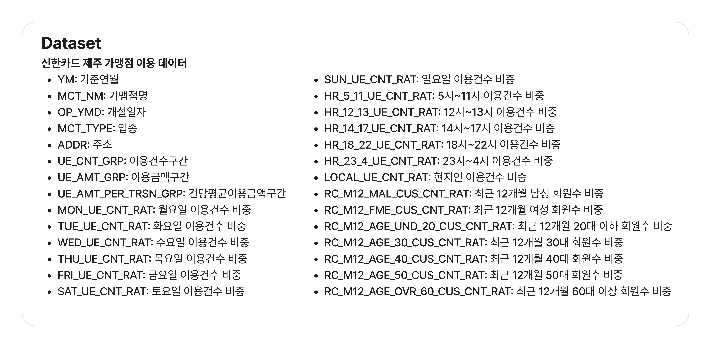
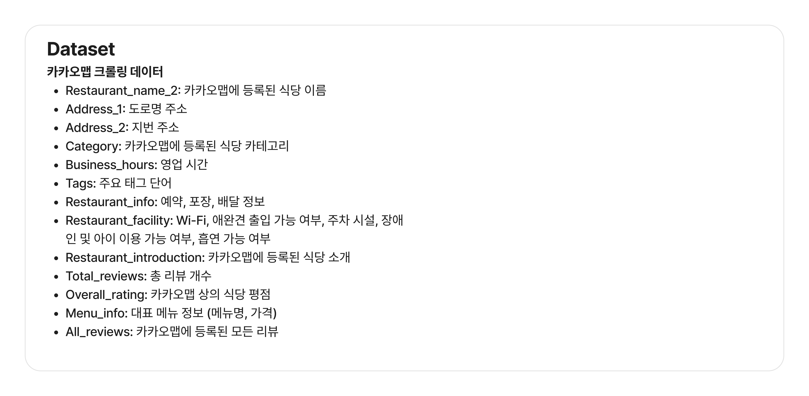
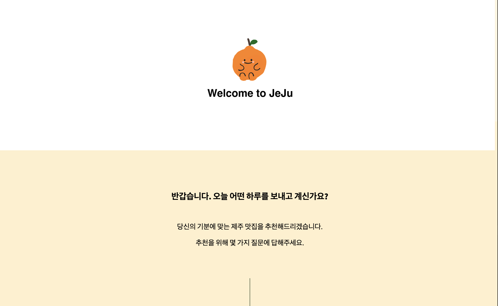
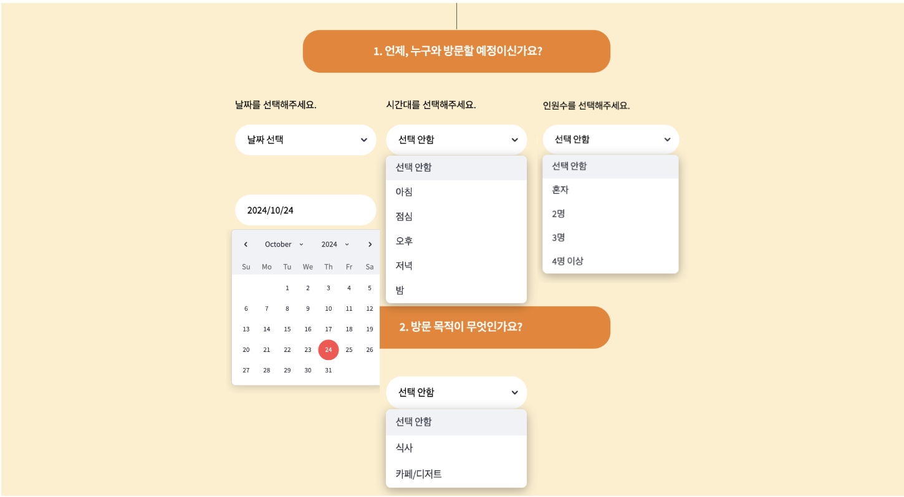
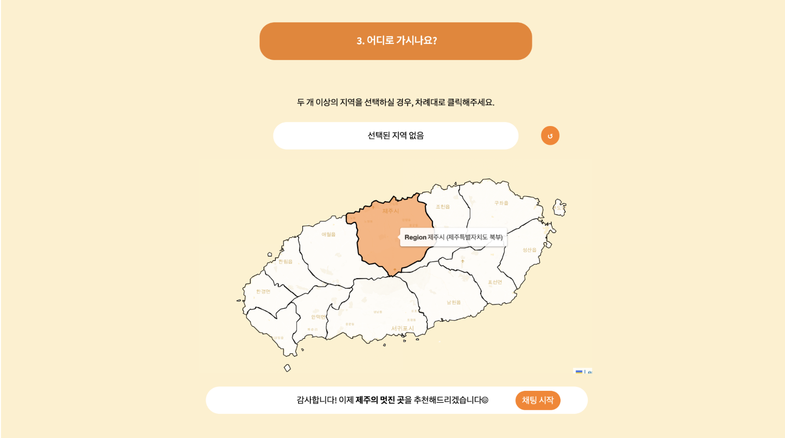
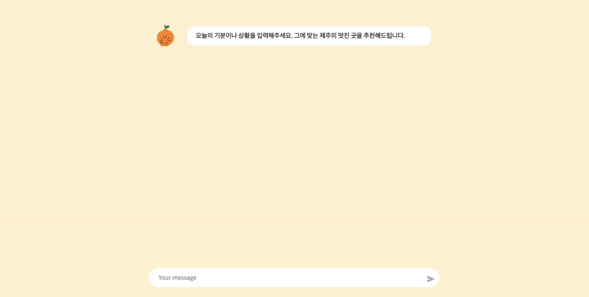

# KAIT 주최 및 신한카드 주관 - 2024 빅콘테스트 생성형AI분야 

  
본 리포지토리는 **LLM활용 제주도 맛집 추천 대화형 AI서비스 개발**에 대한 이쁘면 DA 팀의 제출 서비스 동작을 위한 코드를 포함하고 있습니다.

<br><br> 

<p align="center">

</p>

<br><br>
## Table of Contents
1. [선택 분석 주제 소개](#소개)
2. [데이터셋 소개](#데이터셋-소개)
3. [서비스 개요](#서비스-개요)

## 소개
 
> 분석 주제명: 감정과 상황을 반영한 개인화된 제주 맛집 추천 서비스
<br><br>

### 문제 정의
**문제점**: 기존 맛집 추천 서비스는 평점, 위치, 카테고리에 집중합니다.
- 현대 소비자는 단순한 정보 제공을 넘어, 개인의 취향, 감정, 상황을 반영한 맞춤형 서비스를 기대합니다.
- 특히 음식 선택은 감정과 밀접한 연관이 있으며, 여행지에서의 외식 경험은 그날의 기분, 동행자, 일정에 따라 달라집니다.
- 감정과 상황을 반영한 맞춤형 맛집 추천 서비스는 아직 부족한 상태입니다.


### 목적
1. `정보 검색형 추천`: 신한카드 데이터를 기반으로 정보 검색형 추천을 제공하는 동시에, 사용자의 감정과 상황을 분석하여 맞춤형 맛집 추천을 통해 더욱 만족스러운 외식 경험을 제공하는 것을 목표로 합니다.
2. `사용자 맞춤형 추천`: 숨겨진 현지 맛집부터 인기 있는 장소까지 다양한 선택지를 제공하여 복잡한 검색 없이도 사용자가 원하는 분위기와 시간에 맞는 식당을 쉽게 찾을 수 있도록 돕습니다.


<br><br>

## 데이터셋 소개
서비스 동작에 필요한 최종 데이터셋 소개

1. 신한카드 제주 가맹점 이용 데이터
- 기간 : 2023년 1월 ~ 2023년 12월
- 대상가맹점 : 제주지역 가맹점 중 요식관련 업종이면서 월별 업종별 매출 상위 30% 가맹점	
<p align="center">

</p>

2. 카카오맵 크롤링 데이터
- 신한카드 데이터에 있는 가맹점 이름을 바탕으로 카카오맵에서 해당 식당의 상세보기 링크를 추출
- 식당 정보 및 리뷰 데이터를 수집

<p align="center">

</p>

## 데이터 전처리
신한카드 데이터셋과 카카오맵 크롤링 데이터셋에 대한 데이터 수집 및 전처리 코드는 [`./preprocessing`](./preprocessing) 디렉토리에 저장되어 있습니다.

>신한카드 데이터 전처리
> 1. 컬럼명 한글로 변경
> 2. 월별 통계 데이터에서 `'가맹점명'`과 `'주소'`가 동일한 식당 중복 데이터 처리 후, 고유한 식당 데이터만 남김
> 3. 신한카드 데이터를 기반으로 각 식당의 기본 정보를 요약하여 하나의 문장으로 요약한 `Text 1`칼럼 생성 
> 4. `Address_map` 칼럼에 메인페이지 지도 상에 표시된 13개 구역에 포함되도록 `주소` 수정
> 5. `목적` 칼럼에 `업종`에 따라 ‘식사' 나 ‘카페/디저트'로 분류

> 카카오맵 크롤링 데이터 전처리
> 1. Review_date`에 '정보 없음'과 2020년 이전 데이터는 제거
> 2. 카카오맵의 상세보기 링크 추출을 첫번째 링크 기준으로 가져왔기 때문에, 크롤링하려는 식당과 다른 식당들 제거.
>  >- 링크가 없을 경우도 제거
> 3. `Address_map`에 메인페이지 지도 상에 표시된 13개 구역에 포함되지 않는 식당은 제거.
> 4. `Category`에서 ‘식사' 나 ‘카페/디저트'에 해당되지 않으면 (‘기타’ 카테고리) 제거
> 5. 식당 기본 정보 요약과 리뷰 데이터 기반 15가지 카테고리 키워드를 담은 `Text 2` 칼럼 생성


## 서비스 개요
### 메인 페이지:
<p align="center">

</p>

### 메인 페이지- 선택적인 고정 질문:

<p align="center">

</p>
<p align="center">

</p>

고정 질문:
- 방문 예정 날짜: 캘린더에서 직접 선택
- 시간대: 아침, 점심, 오후, 저녁, 밤 중 선택
- 인원수: 혼자, 2인, 3인, 4인 이상 중 선택
- 방문 목적: 식사, 카페/디저트, 선택 안 함
- 방문 지역: 사용자가 방문하고자 하는 제주도 지역 선택

### 챗봇 대화 페이지:
</p>
<p align="center">

</p>


## 레포지토리 구조 (Repository Structure)

```
# 서비스 구현에 필요한 데이터들을 보관하는 디렉토리
└──data
│   ├── categorized_restaurants.csv # 식사, 카페/디저트 분류를 위한 파일
│   ├── crawled_kakao_restaurant_with_address_map_text2.csv # 최종 카카오맵 크롤링 데이터
│   └── shinhancard_data_with_text.csv # 최종 신한카드 데이터
│ 
├──modules
│   ├── modified_updated_text1_restaurant_embeddings.npy # 최종 신한카드 데이터 임베딩 파일
│   ├── modified_updated_text1_restaurant_faiss.index # 최종 신한카드 데이터 FAISS 인덱스
│   ├── updated_text2_kakao_restaurant_embeddings.npy # 최종 카카오맵 데이터 임베딩 파일
│   ├── updated_text2_kakao_restaurant_faiss.index # 최종 카카오맵 데이터 FAISS 인덱스
│   ...
│   └──
```